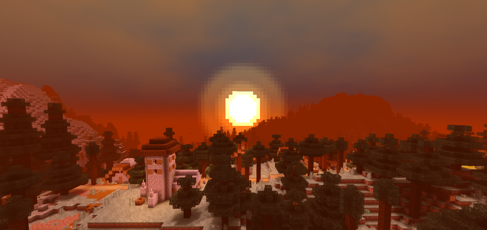
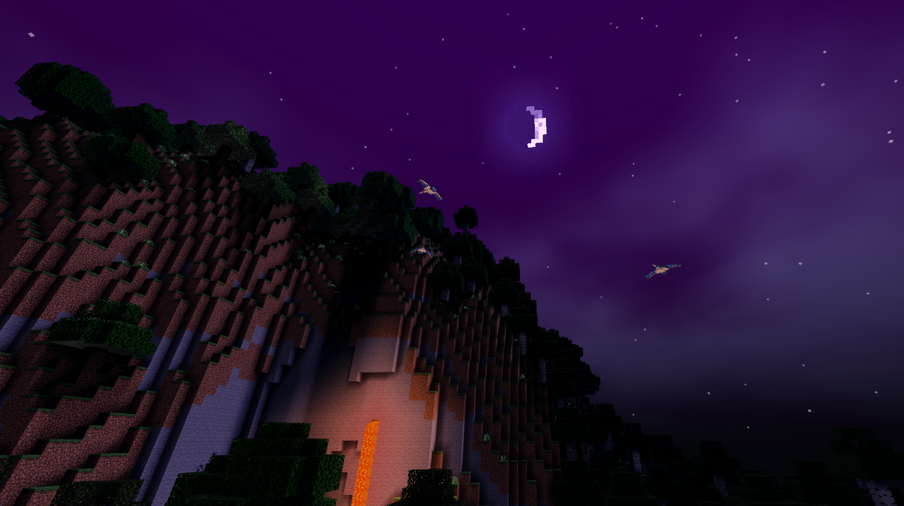
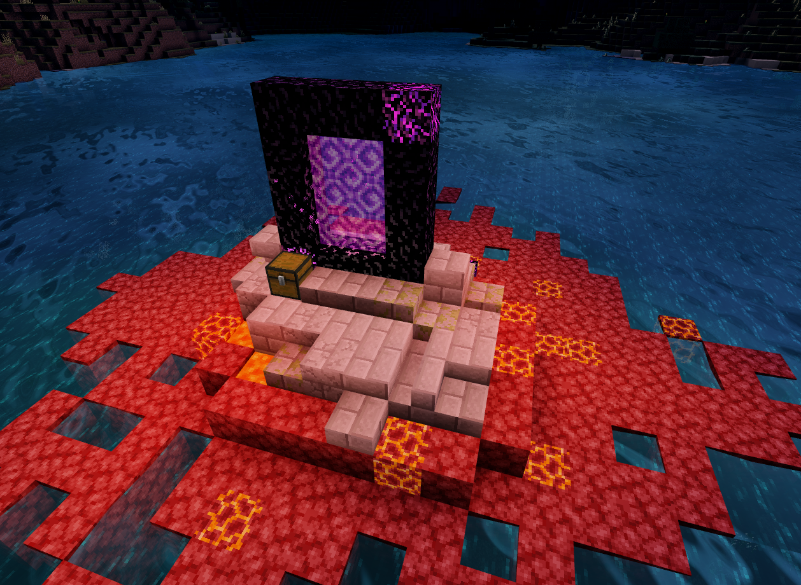

---

# **Rinrin Shader** 

    Rinrin Shaders are made with self satisfaction. 
    Based on Rinrin's distorted perspectives.

---

> ### Download 

&emsp;See [releases](https://github.com/Rinrin0413/Rinrin_Shader/releases)

&emsp;

---

> ### Supported platforms & versions

&emsp;Platform : `Minecraft for Windows` 
&emsp;Version : `v1.16.100 and above` or `x86(32bit)`

---

> ### Major features

- New shadow 
- New light color
- Fantastic sky
- Realistic clouds⛅
- Water surface reflections
- Pseudo reflections of various blocks
- Clear water
- Waving grasses🍃
- Fluttering grass blocks

---

> ### Pictures

photos

---

> ### Known issues

- When it rains, the ground seen from the sky is too white.
- The sun is too bright.
- Unnatural grass waving.
- Grasses and Leaves that glows.

---

> ### License

 

&emsp;

---