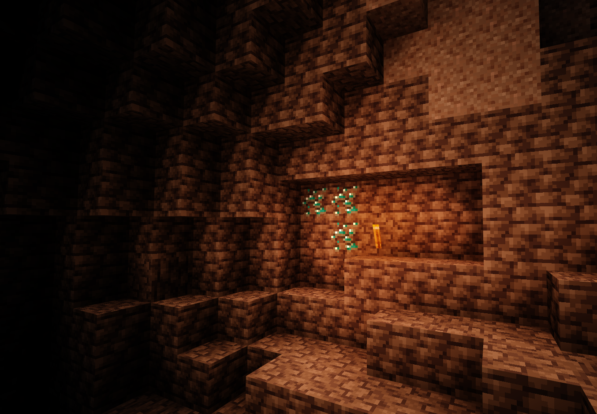
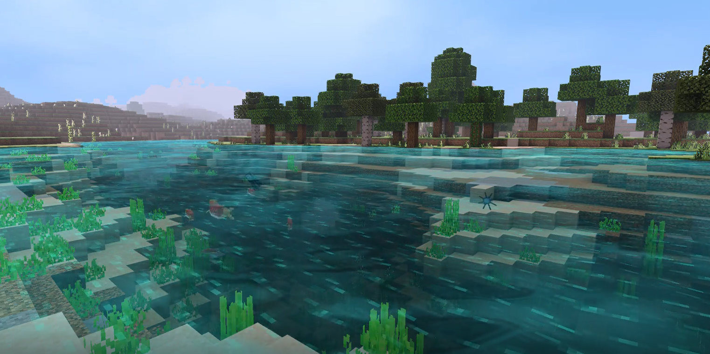
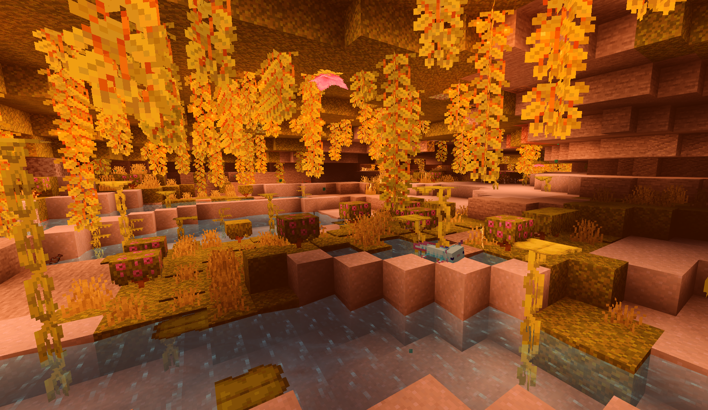

___
# **Rinrin Shader**
    Rinrin Shaders are made with self satisfaction. 
    Based on Rinrin's distorted perspectives.
___
> ### Download
&emsp;See [releases](https://github.com/Rinrin0413/Rinrin_Shader/releases)
___
> ### Supported platforms & versions
&emsp;Platform : `Windows10` 
&emsp;Version : `v1.16.100 and above`
___
> ### Major features
* New shadow 
* New light color
* Fantastic sky
* Realistic clouds⛅
* Water surface reflections
* Pseudo reflections of various blocks
* Clear water
* Waving grasses🍃
* Fluttering grass blocks
___
> ### Pictures

___
> ### Known issues
* When it rains, the ground seen from the sky is too white.
* The sun is too bright.
* Unnatural grass waving.
___
> ### License
&emsp; 
&emsp;Rinrin Shader by [@Rinrin_2nd](https://twitter.com/Rinrin_2nd) is licensed under a <a rel="license" href="http://creativecommons.org/licenses/by-nc-sa/4.0/">Creative Commons Attribution-NonCommercial-ShareAlike 4.0 International License</a>.
___
